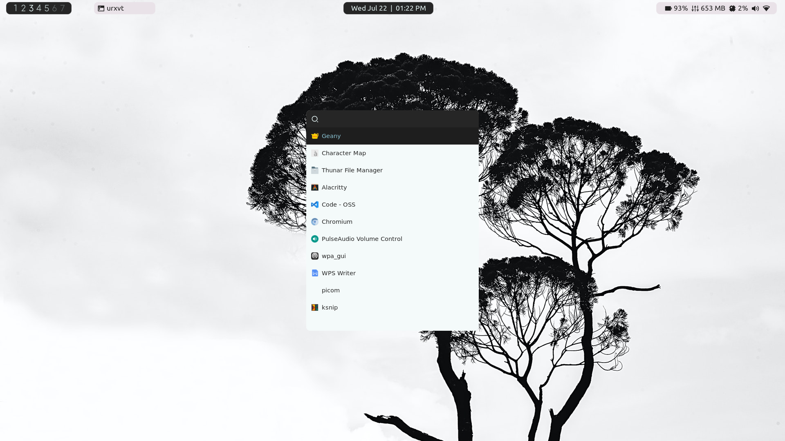
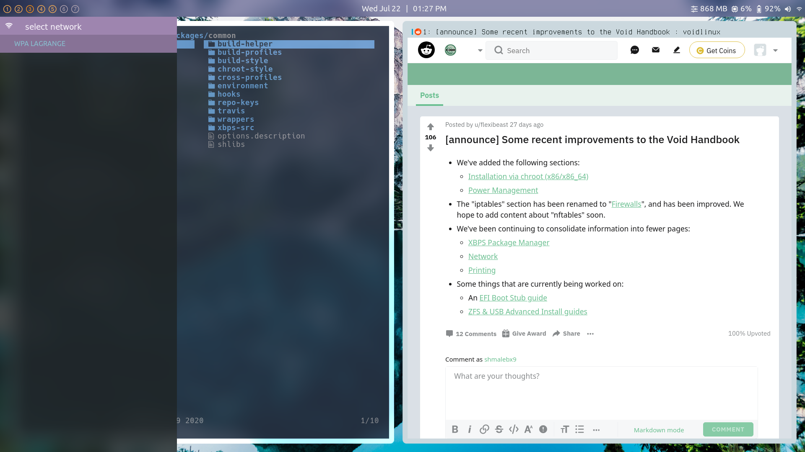
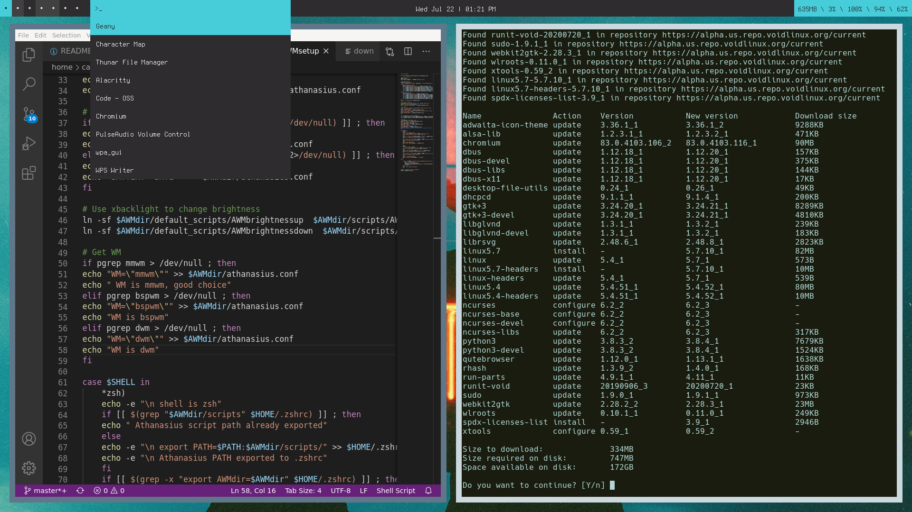
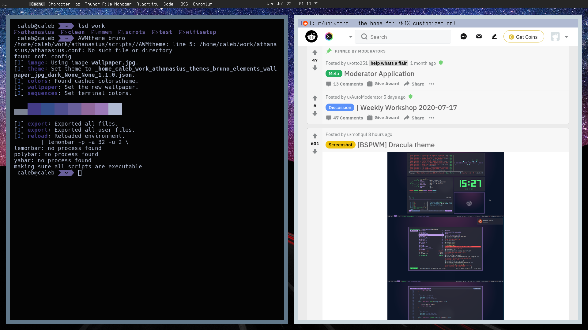
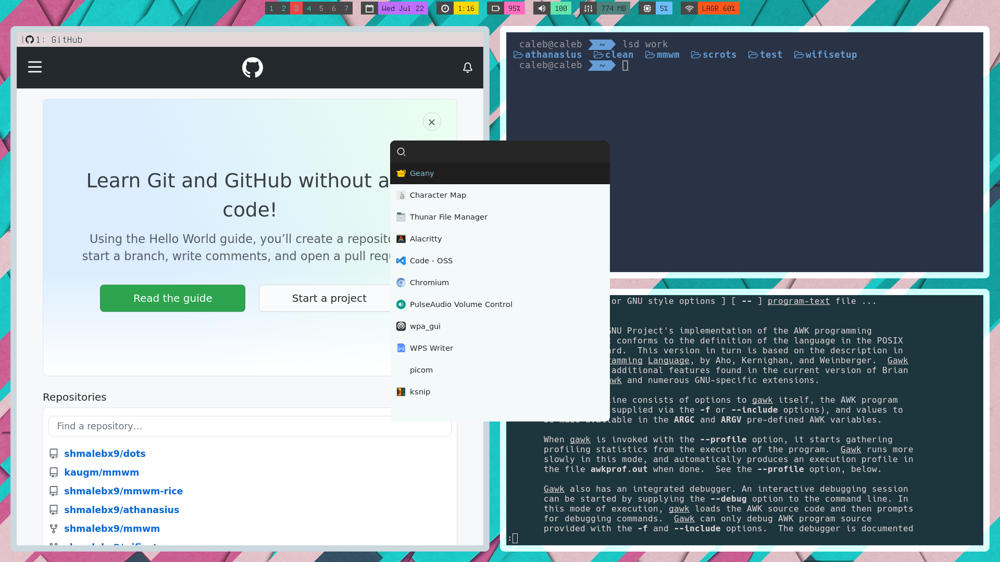

# Athanasius Rice Manager

Athanasius is a set of themes and bash utilities to handle switching between rices easily. Athanasius links configuration files for utilities like rofi, lemonbar, and picom to scripts in a central directory in the user's $PATH. Bars, compositors, and other programs can then be run with the specified theme without direct reconfiguration. The rices included are aimed at [MMWM](https://github.com/kaugm/mmwm) but are somewhat compatible with other WM's. Athanasius aims to make ricing easy by population athanasius.conf with variables useful in ricing scripts and config files. The autogenerated config file and related scripts make it easy to shift between machines and share configs by detecting the correct variables and frontloading the work of making your scripts compatible with other systems. For example, instead of sharing a bar script which detects whether the user is running pulseaudio or alsa, the scripts AWMgetvolume and AWMgetmute are already symlinked to the correct script in the default_scripts directory.

The included themes make use of lemonbar-xft over polybar or yabar to cut down on system resource usage. Each theme includes a bar which can pull system information seamlessly without prior configuration. The bars update volume and battery in real time without the need for loops or external scripts by reading the output of acpi_listen.

## Usage
The setup script will automatically detect your battery, audioservice (pulseaudio or alsa), network interface, and WM and adjust its scripts accordingly.

To use athanasius in you own scripts simply source the athanasius configuration file to get variables like battery number (BAT1 or BAT0), audioservice (pulseaudio or alsa), wireless interface, and WM. This file is autogenerated once with the AWMsetup script which avoids the overhead of having the user input the correct values or having the script obtain them on every run. To source the file add:' . "$AWMdir/athanasius.conf"' to the top of your script. $AWMdir is a persistent environmental variable which points to wherever the user stores athanasius.

#### AWMtheme

To set the current theme type AWMtheme 'themename'

example:

     AWMtheme leo
To create a theme simply create a directory in the themes folder and add configs to configs folder. To get a better idea how to create themes, check out the five included themes.

#### AWMpatch

This utility is useful if you don't want to have your rice stored in the athanasius directory. AWMpatch will patch configs in their respective default locations. AWMpatch takes a link to a file or github/gitlab link or local file and patches your existing config. Old configs are stored in the athanasius backups folder. AWMpatch can also easily revert the most recent changes made to the system. 

To use simply run :
     AWMpatch 'config'
     
     AWMpatch 'github link'

     AWMpatch -r

#### AWMmenu
The theme backend rices rofi by pointing to the correct config in a script called 'AWMtheme.' To use it just run:
      AWMmenu

#### Useful scripts
To get volume information or change volume

     AWMgetvolume

     AWMgetmute

     AWMaudioup

     AWMaudiodown

These commands are useful in bar scripts or WM configurations since the script will have the desired effect regardless of whether the user is running pulseaudio or alsa.

To stop all proccesses initiated by the current theme.

     AWMthemedown

# Themes
To create a theme, simply add the config files you want to a directory in the themes directory. The name of any theme is the name of the directory where config files are stored. Athanasius comes with five basic example themes to demonstrate the basic file structure.

## Michael

## Simeon

## Leo

## Bruno

## Akita

#### Theme Dependencies

- **lemonbar-xft**
- **acpid**
- **rofi**
- xdotool & xprop for michael theme
- [picom-ibhagwan](https://github.com/ibhagwan/picom) for all but Bruno and Leo

#### installation
1. clone the repo wherever you like
2. run the AWMsetup script
3. add 'AWMstart' to ~.xinitrc

Credits
------

#### Icon Font
The icon font is created entirely from free icons not made by me. The icon font is made up of the following:

[RemixIcons](https://remixicon.com/)

[Picol Icons](http://picol.org/)

[Font Awesome](http://fontawesome.io/)

[Ionicons](http://ionicons.com/)

[OctIcons](https://github.com/github/octicons)

[Elusive Icons](http://shoestrap.org/downloads/elusive-icons-webfont/)

[Minicons](http://www.webalys.com/minicons/icons-free-pack.php)

[Foundation Icons](http://zurb.com/playground/foundation-icon-fonts-3)

[Entypo](http://www.entypo.com/)

[Metrize](http://www.alessioatzeni.com/metrize-icons/)

[Iconic](http://www.somerandomdude.com/work/iconic/)

[Steadysheets](http://steadysets.com/)

[Other Icons](http://othericons.com/)

#### Wallpapers
Wallpaper Photo by [eberhard grossgasteiger](https://www.pexels.com/@eberhardgross) from Pexels

wallpaper Photo by [Min An](https://www.pexels.com/@minan1398?utm_content=attributionCopyText&utm_medium=referral&utm_source=pexels) from Pexels

Wallpaper Photo by [Anni Roenkae](https://www.pexels.com/@anniroenkae) from Pexels

Wallpaper by [Dark Indigo](https://www.pexels.com/@darkindigo?utm_content=attributionCopyText&utm_medium=referral&utm_source=pexels) from Pexels

Wallpaper from [Imgur](https://imgur.com/TS5S3)

#### Thanks
The bar scripts borrow work from [fsfg](https://gitlab.com/fsfg/dotfiles/) and [nan0s7](https://github.com/nan0s7/drowsylemon). Work on rofi menus taken from [CaptainUereka](https://github.com/CaptainEureka).